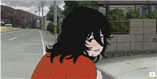
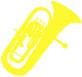

你好，我是 **19y**。这个博客记录我在嵌入式、编程与学习过程中的笔记和踩坑经历，也会整理一些竞赛与开源项目的实践心得。

## 友情链接

    <a class="friend-link" href="https://ageha.cn/" target="_blank" rel="noopener noreferrer">
        

            
            
        

    </a>
    <a class="friend-link" href="https://tak1na.cn/" target="_blank" rel="noopener noreferrer">
        

            
            
        

    </a>

